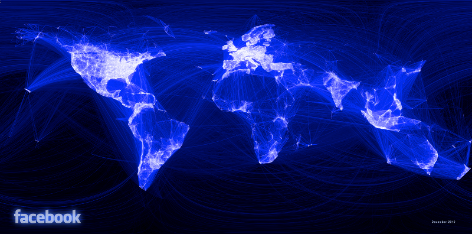
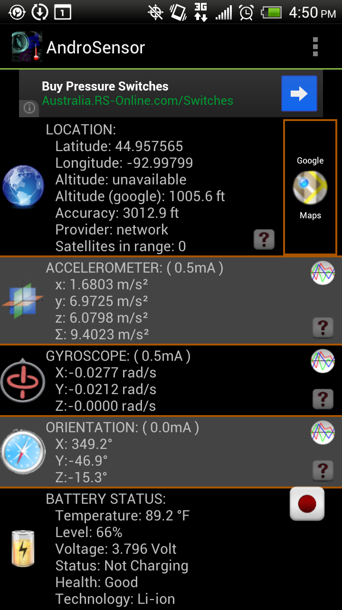
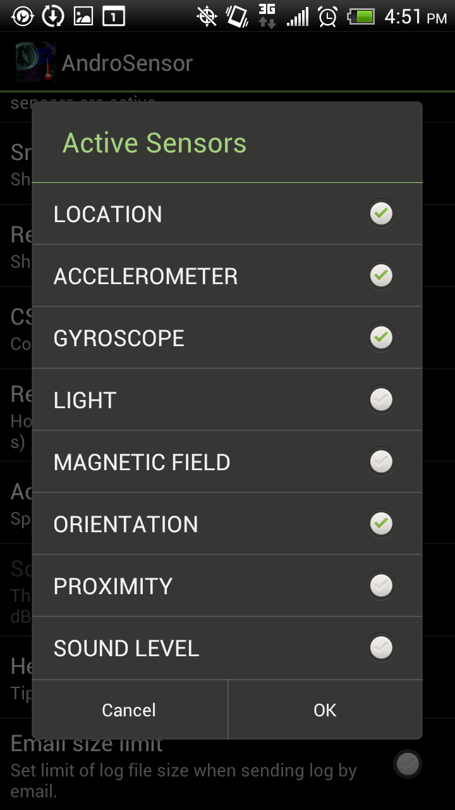

# Intro

-   Brief overview of geo-spatial miscellany in R
-   Key libraries
    -   Getting coordinates/working with Google: `ggmap`
    -   Great circle paths: `geosphere`
    -   Larger scale maps: `maps` (comes with R)
    -   Projection conversion/KML generation: `rgdal`, `maptools`, and `sp`
    -   Plotting: `ggplot2`

-   This is a hobby and I'm *not* a professional&#x2026;

---

# Using `ggmap` to get lat/lon coordinates

-   Just type what you wold type into Google Maps

    # install.packages("ggmap")
    > library(ggmap)
    > geocode("St. Paul, MN")

            lon     lat
    1 -93.08996 44.9537

    > geocode("2115 Summit Ave., St. Paul, MN")

            lon      lat
    1 -93.18971 44.94412

    > geocode("University of St. Thomas, MN")

            lon      lat
    1 -93.18975 44.94192

---

# Grabbing maps

Methods
-   Lat/lon + zoom level
-   Bounding box

Sources

-   Google
-   Stamen
-   Cloudmade
-   OpenStreetMap

---

# Using lat/lon + zoom

    
    loc <- geocode("2115 Summit Ave, St. Paul, MN")
    ust <- get_map(location = c(lon = loc$lon, lat = loc$lat),
                    zoom = 15, source = "google",
                    maptype = "hybrid", crop = T)
    
    ggmap(ust)

---

# Using lat/lon + zoom

<./img/ust-coords-zoom.pdf>

---

# Using lat/lon + bounding box

    
    loc <- geocode("2115 Summit Ave, St. Paul, MN")
    
    box <- c(left = loc$lon - 0.04, bottom = loc$lat - 0.02,
             right = loc$lon + 0.04, top = loc$lat + 0.02)
    
    ust_box <- get_map(location = box, source = "stamen",
                       maptype = "watercolor", crop = T)
    
    ggmap(ust_box)

---

# Using lat/lon + bounding box

<./img/ust-coords-box.pdf>

---

# Overplotting ggmaps

-   `ggmap()` is an addition to `ggplot2` functionality
-   Thus, layering standard `ggplot2` graphics on top of maps is easy!

    locs <- data.frame(names = c("st. paul", "minneapolis"))
    locs <- cbind(locs, geocode(as.character(locs$names)))
    
    mid <- get_map(location = c(lon = mean(locs$lon), lat = mean(locs$lat)),
                   zoom = 10, source = "stamen", maptype = "toner", crop = T)
    
    p <- ggmap(mid)
    p <- p + geom_point(aes(x = lon, y = lat, colour = factor(names)),
                        dat = locs, size = 6)
    p <- p + scale_colour_discrete("Location")
    p

---

# Overplotting ggmaps

<./img/ggmap-points.pdf>

---

# Working with world/contry maps

-   `get_map()` limited by allowable zoom levels (e.g. `0 < zoom < 21`)
-   To plot larger scale data, the `maps` package is probably preferred
-   Various maps available; see [documentation](http://cran.r-project.org/web/packages/maps/maps.pdf) for details

    
    library(maps)
    world <- map_data("world")
    head(map, 5)

           long      lat group order region subregion
    1 -133.3664 58.42416     1     1 Canada      <NA>
    2 -132.2681 57.16308     1     2 Canada      <NA>
    3 -132.0498 56.98610     1     3 Canada      <NA>
    4 -131.8797 56.74001     1     4 Canada      <NA>
    5 -130.2492 56.09945     1     5 Canada      <NA>

---

# World map example

    # pay attention to column names (lon vs. long!)
    p <- ggplot(world, aes(x = long, y = lat, group = group))
    p <- p + geom_polygon(colour = "white")
    p

<./img/world.pdf>

---

# United States example

    usa <- map_data("state")
    p <- ggplot(usa, aes(x = long, y = lat, group = group))
    p <- p + geom_polygon(colour = "white")
    p

<./img/usa.pdf>

---

# Subsetting areas

    states <- c("minnesota", "wisconsin", "illinois", "indiana",
                "iowa", "missouri", "michigan")
    
    states_map <- map_data("state")
    
    states_map <- states_map[states_map$region %in% states, ]
    
    p <- ggplot(states_map, aes(x = long, y = lat, group = group))
    p <- p + geom_polygon(colour = "white")
    p

---

# Subsetting areas

<./img/some-states.pdf>

---

# A hobby project

-   Internal talks at 3M typically given live to US audience; recorded for int'l
-   Organized two "reverse talks" to reach a wider global audience
-   Attendance records shattered
-   Wanted to visualize impact/reach!

---

# The inspiration

---

# Great circle basics

-   `gcIntermediate()` function from  `geosphere` package

    library(geosphere)
    arc <- gcIntermediate(c(lon_1, lat_1), c(lon_2, lat_2),
                          n = steps, addStartEnd = T)

---

# Crossing the Date Line

    # draw great circles from St. Paul to everywhere else
    gcircles <- lapply(1:nrow(end), function(i) {
      temp <- gcIntermediate(start[, c("lon", "lat")], end[i, c("lon", "lat")],
                             n = 50, addStartEnd = T, breakAtDateLine = T)
    
      # if temp is a list, rbind and return single data.frame
      if(is.list(temp) == T) {
        ids <- c(rep(paste0("i", i), nrow(temp[[1]])),
                 rep(paste0("j", i), nrow(temp[[2]])))
        temp <- as.data.frame(rbind(temp[[1]], temp[[2]]))
        temp$id <- ids
      }
      
      ...
    })

---

# The plot

    p <- ggplot()
    p <- p + geom_polygon(aes(x = long, y = lat, group = group),               # world map
                          data = world, colour = "gray10", fill = "gray95")
    p <- p + geom_line(aes(x = lon, y = lat, group = id),                      # great circles
                       dat = gcircles, lwd = 0.4, alpha = 0.5)
    p <- p + geom_point(aes(x = lon, y = lat, size = sqrt(total/pi)),          # points
                        dat = talks_agg, colour = "#555599")
    p <- p + scale_size("Total participants\n(both events)",                   # adjust legend
                        limits = c(0, max(sqrt(talks_agg$total / pi)) + 1),
                        breaks = sqrt(c(10, 50, 100) / pi),
                        labels = c(10, 50, 100), range = c(1, 10))
    p <- p + theme_bw()                                                        # bw theme
    p <- p + theme(axis.text = element_blank(), axis.title = element_blank(),  # tweak
                   axis.ticks = element_blank(), panel.grid = element_blank(),
                   legend.position = c(0.092, 0.15))

---

# The result

<./img/great-circles.pdf>

---

# Infographic

---

# Creating `.kml` files for Google Earth

-   Pretty easy! (Follow along with [this](http://www.nceas.ucsb.edu/scicomp/usecases/shapeFileToKML), [this](http://stackoverflow.com/questions/7813141/how-to-create-a-kml-file-using-r), and [this](http://stackoverflow.com/questions/21487010/assistance-with-name-and-styleurl-in-kml-when-using-writeogr-from-rgdal))

    
    talks <- read.csv("./data/talk-locations.csv")
    talks <- talks[!duplicated(talks[, c("country", "city")]),
                   c("city", "lat", "lon")]
    
    talks_sp <- talks
    coordinates(talks_sp) <- c("lon", "lat")
    proj4string(talks_sp) <- CRS("+init=epsg:4238")
    talks_ll <- spTransform(talks_sp,
                            CRS("+proj=longlat +datum=WGS84"))
    
    kmlPoints(g_earth_ll["city"], kmlfile = "./data/talks-google-earth.kml",
              name = talks_ll$city,
              icon = "http://upload.wikimedia.org/wikipedia/commons/a/af/Tux.png")

---

# todo screenshot of Google Earth

-   Also create great circle data

---

# Getting some GPS data

[AndroSensor](https://play.google.com/store/apps/details?id=com.fivasim.androsensor&hl=en)

1.       :B_column:BMCOL:

    

    
    

2.       :B_column:BMCOL:

    

    
    

---

# Reading/cleaning the data

    gps <- read.csv("./data/gps-data.csv", sep = ";")
    
    # reduce to columns of interest
    gps <- gps[, c(10, 11, 13, 18)]
    
    # give the data sensical names
    names(gps) <- c("lat", "lon", "speed", "time")
    head(gps, 5)

           lat       lon speed time
    1 44.92633 -93.09771    NA    5
    2 44.92633 -93.09771    NA  505
    3 44.92633 -93.09771    NA 1011
    4 44.92633 -93.09771    NA 1532
    5 44.92626 -93.09747     0 2032

---

# Grab a background map

    box <- c(left = min(gps$lon), bottom = min(gps$lat),
             right = max(gps$lon), top = max(gps$lat))
    
    gps_map <- get_map(location = box, source = "stamen",
                       maptype = "terrain", crop = T)

<./img/gps-map.pdf>

---

# Overplot with speed

    p <- ggmap(gps_map) + geom_point(aes(x = lon, y = lat, colour = speed),
                                     gps, size = 3)
    p <- p + scale_colour_continuous(low = "black", high = "red", na.value = NA)

<./img/gps-map-over.pdf>

---

# Public transportation efficiency

-   Background information can be found [here](https://github.com/tcrug/public-transpo)

    transpo <- read.csv("./data/public-transpo.csv")
    
    transpo_agg <- ddply(transpo, .(city, state), summarize,
                         btus_pmile_ave = mean(btus_pmile),
                         density = mean(population) / mean(service_area_sq_mi))
    transpo_agg$lookup <- paste0(transpo_agg$city, ", ", transpo_agg$state)
    
    coords <- geocode(transpo_agg$lookup)
    
    transpo_agg <- cbind(transpo_agg, coords)
    
    # let's not run that again...
    write.table(transpo_agg, file = "./data/transpo-agg-geocoded.csv", row.names = F, sep = ",")

---

# Efficiency visualized

    plot <- read.csv("./data/transpo-agg-geocoded.csv")
    plot <- plot[plot$state != "AK" & plot$state != "HI", ]
    usa <- map_data("state")
    plot <- plot[order(plot$btus_pmile_ave), ]
    p <- ggplot() + geom_polygon(aes(x = long, y = lat, group = group),
                                 data = usa, fill = "gray95", colour = "gray10")
    p <- p + geom_point(aes(x = lon, y = lat, colour = btus_pmile_ave,
                        size = sqrt(density)/pi), data = plot)
    p <- p + scale_colour_gradient("log(BTUs / passenger-mile)", trans = "log")
    p <- p + scale_x_continuous("") + scale_y_continuous("")
    p <- p + scale_size_continuous("Passengers / Sq. Mile", breaks = c(10, 20, 30, 40),
                                   labels = round((c(10, 20, 30, 40)*pi)^2, 0),
                                   range = c(1, 8))
    p <- p + theme_bw() + theme(axis.text = element_blank(), axis.ticks = element_blank())

---

# Efficiency visualized

<./img/transpo-plot.pdf>

# Converting data to `.json` for d3

-   R is an excellent for working with data
    -   Reshape (wide &harr; long)
    -   Calculate columns
    -   Summarize, e.g. with `ddply`
-   Manipulate in R, then output to `.json`, d3's friend
-   Helpful function found [here](http://theweiluo.wordpress.com/2011/09/30/r-to-json-for-d3-js-and-protovis/)

    
    plot_json <- toJSONarray(plot)
    file_con <- file("./d3/transpo.json")
    writeLines(plot_json, file_con)
    close(file_con)

---

# And voila, a d3 version!

---

# Reference

-   [ggmap: Spatial Visualization with ggplot2](http://stat405.had.co.nz/ggmap.pdf), Kahle \\& Wickham
-   [How to draw good looking maps in R](http://uchicagoconsulting.wordpress.com/2011/04/18/how-to-draw-good-looking-maps-in-r/), uchicagoconsulting
-   [Great circles on a recentered worldmap](http://www.stanford.edu/~cengel/cgi-bin/anthrospace/great-circles-on-a-recentered-worldmap-in-ggplot), AnthroSpace
-   [How to map connections with great circles](http://flowingdata.com/2011/05/11/how-to-map-connections-with-great-circles/), FlowingData
-   For any given package, find the documentation on [CRAN](http://cran.r-project.org/)!

Code and files from this presentation are on [github](https://github.com/jwhendy/devFest-geo)
